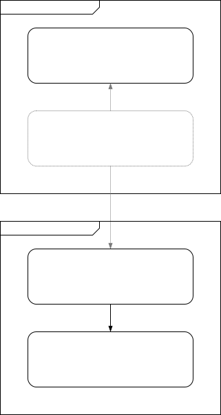

# `aop-ts`: Aspect-Oriented Programming utilities with typed API

## Core package (`@aop-ts/interception`)

### Introduction

> **TODO:** This project is **not** yet documented. The work on that is currently in progress.

`@aop-ts/interception` is a tiny package helping to intercept (wrap) certain methods with calls to user-defined interceptors. At its current stage, it is more of an approach than introducing much of 3rd party code.

Importantly, note that `@aop-ts/interception` is designed with a very specific use-case in mind that occurs in only certain types of projects.

> **Tip:** Because of that, before deciding on using `@aop-ts/interception`, make sure to understand the design points below.
>
> Also, consider the [pros and cons](./docs/pros-and-cons#.md) of this approach to help yourself asses if this is the appropriate for your project.

The **core design points** behind how this package are:

- **OOP-like codebases**. While multiple paradigms can be used to solve the same problems, this package aims specifically Object-Oriented codebases based on ECMAScript's `class` feature. That is not to say that you cannot mix and match other approaches (functional, procedural, reactive and so on).
- **DI-friendliness**. Although the projects depending on this package **may** or **may not** make use of [Dependency Injection](https://en.wikipedia.org/wiki/Dependency_injection), it is designed in a way to gain the most benefits from integrating it with DI systems.
  > **Example:** One example would be the ability to inject existing dependencies that already occur in the DI system(s) of a given project. With certain other approaches to interception (say, [TS class decorators](https://www.typescriptlang.org/docs/handbook/decorators.html#class-decorators) that too has its own benefits) it would be difficult or impossible to achieve that goal.
- **Type-safeness**.
  > **TODO:** Elaborate.
- **Power**.
  > **TODO:** Elaborate.
- **Granularity**.
  > **TODO:** Elaborate.

Let's imagine decorating some class (in the sense of [the "classic" Decorator Pattern](https://en.wikipedia.org/wiki/Decorator_pattern), not the [TypeScript decorators](https://www.typescriptlang.org/docs/handbook/decorators.html)):

The decorator can instead depend (via [constructor injection](https://en.wikipedia.org/wiki/Dependency_injection#Constructor_injection)) on a user-defined interceptor:

In fact, there is no limit to the number of wrappers. With caching, for instance, latencies can be greatly reduced:

> **TODO**: Add tools to the package that will allow composing multiple decorators.

## NestJS adapters `@aop-ts/interception-nest`

While Nest already provides its [own interceptors](https://docs.nestjs.com/interceptors) as a part of its architecture, these packages, in turn, can help address two potential issues:

- intercepting deeper injectable classes (services) and not only the edges (controllers),
- intercepting more granularly, at the level of methods.

Let's consider a simple example:

## Using with InversifyJS

> **TODO:** This might potentially be done in the future as a part of _Corner of hope_.

## Using with other libraries or frameworks

> **TODO:** This might potentially be done in the future as a part of _Corner of hope_.
